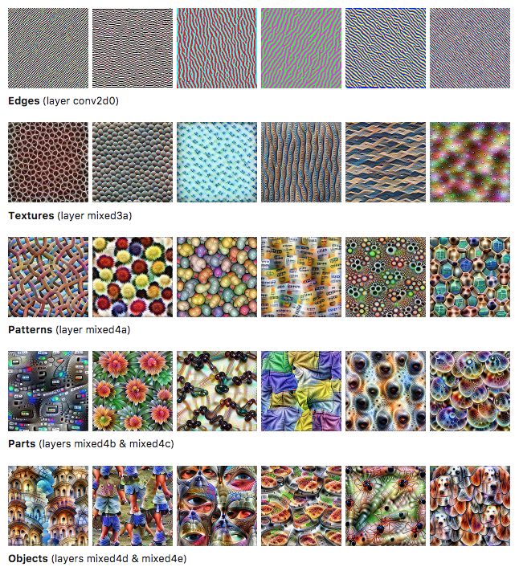
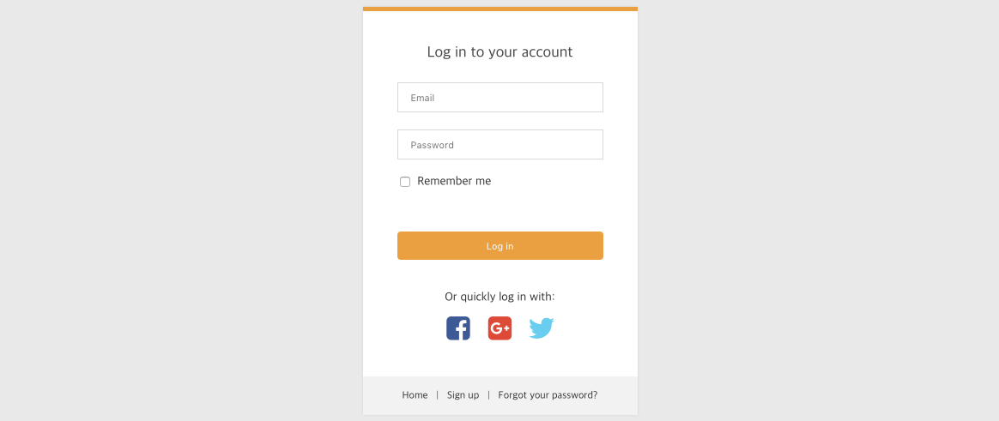
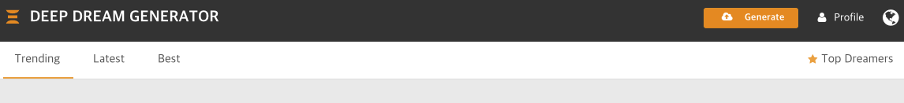
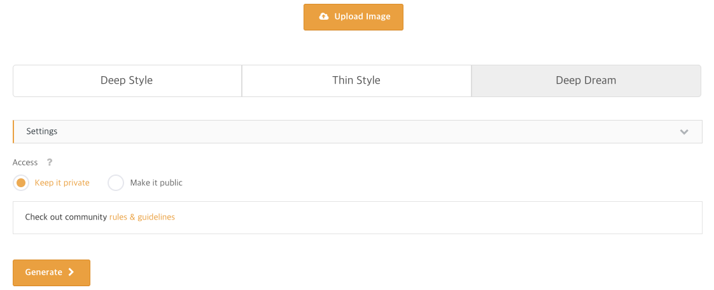
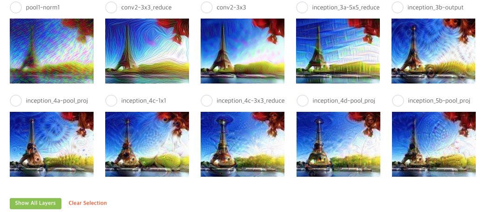
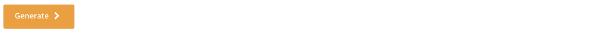

<h2><a name="d1" style="color:black; text-decoration:none;">Deep Dream 소개</a></h2>

인공 신경망에서 학습된 뉴런의 대다수는 추상성의 계층에 따라서 어떠한 추상 또는 패턴을 탐지합니다. 
이러한 추상 또는 패턴의 예를 보자면 다음과 같습니다.

 

사진출처: https://distill.pub/2017/feature-visualization/

위의 사진은 이미지 분류를 위하여 학습된 필터를 계층에 따라서 시각화 한 것으로 Edges부터 Objects까지 추상성의 변화과정을 보여줍니다. 예를 들어, 인공신경망의 하위 층(윗 두줄)에서는 외곽선 또는 질감 같은 낮은 수준의 패턴을 학습하고, 상위 층(아래 두 줄)에서는 꽃, 건물 그리고 눈과 같은 상위 수준의 물체를 학습합니다. 

우리는 이러한 필터를 이용하여 다음과 같은 매우 혼란스러운 작품을 만들어 볼 수 있습니다. 

 

GIF출처: https://cdn-images-1.medium.com/max/800/1*PKIwmv_VuRKnaECuKkIvtQ.gif

위와 같은 그림을 Deep Dream이라 부르며, 인공 신경망의 학습에 사용된 데이터가 강아지, 고양이와 같은 동물을 많이 포함하였기에, 어류, 개, 눈알의 모양으로 왜곡되거나, 우주에서 온 듯한 기이한 색채를 뿌리는 형태로 이미지가 변환되는 성향이 강합니다. 하여 코스믹 호러 이미지라거나 LSD에 의한 환각체험 같다는 평도 많이 있습니다. (from <a href="http://nuriwiki.net/wiki/index.php/Google_Deep_Dream" target="_blank">누리위키</a>)

이러한 꿈꾸는듯한 이미지는 다음의 방법으로 생성됩니다.  

- Seed Image: 변환하고자 하는 이미지를 선택합니다.
- Layer Selection: 변환하고자 하는 추상성의 레벨을 선택합니다. (층이 높을수록 더욱 추상적, 하위일수록 점선면 패턴과 같이 더욱 직관적인 패턴이 Seed Image에 덧씌워집니다.)
- Activation Maximization: 해당 층에서의 평균 뉴론 반응수치를 최대화하고자 Seed Image를 계속해서 수정해줍니다.
- Hallucinated Image: Seed Image가 선택한 층의 뉴론 반응수치를 최대화하도록 변환됩니다. 

**본 튜토리얼**에서는 다음 섹션에서 이러한 Deep Dream을 기성 플랫폼을 이용하여 손쉽게 사용할 수 있는 방법에 대하여 소개하고, 더 나아가 마지막 섹션에서 직접 코딩을 통하여 해당 작업을 수행해 봅니다.

<h2><a name="d2" style="color:black; text-decoration:none;">Deep Dream 나만의 그림 만들기</a></h2>

Deep dream을 이용하여 나만의 추상적인 그림을 만들어 보고자 합니다.  

<a href="https://deepdreamgenerator.com/generator" style="text-decoration:none;transition: color ease 0.7s;" target="_blank">"DEEP DREAM GENERATOR"</a>라는 기성 사이트를 이용하여 우리는 가지고 있는 이미지에 원하는 추상성을 손쉽게 덧입힐 수 있습니다.

먼저, 로그인을 한 후 (페이스북, 구글 플러스, 트위터 계정으로 손쉽게 로그인 할 수 있습니다), 

 

 

우측 상단의 "Generate" 버튼을 클릭하시면, 

 

 

다음과 같은 페이지로 이동합니다. 
"Deep Style", "Thin Style"와 같은 내용은 다음 튜토리얼에서 다룰 것이기에 본 페이지에서는 바로 "Deep Dream"항목을 클릭합니다. (다음 튜토리얼 Style Transfer 내용을 숙지하신 후 역시 해당사이트에서 바로 이용하실 수도 있습니다.)

 

 

아래와 같은 화면이 나오는데, "Settings"를 클릭하면 아래와 같이 인공신경망의 다양한 계층들을 선택할 수 있게 나옵니다. (아래의 "Show All layers"를 클릭하시면 더욱 많은 계층을 볼 수가 있습니다.)

 

 

 

 

원하는 풍의 이미지를 선택하신 후, 맨 밑의 아래 "Generate"버튼을 클릭하시면 최종 결과물을 얻을 수 있습니다.

 

 

위와 같은 방법을 통하여 우리는 다양한 작품을 만들 수가 있는데,  아래 링크들은 Deep Dream을 이용한 작가들의 작품 예시입니다. 
<a href="http://www.miketyka.com/?s=deepdream" style="text-decoration:none;transition: color ease 0.7s;" target="_blank">http://www.miketyka.com/?s=deepdream</a> 
<a href="http://barabeke.it/portfolio/deep-dream-generator" style="text-decoration:none;transition: color ease 0.7s;" target="_blank">http://barabeke.it/portfolio/deep-dream-generator</a> 

<h2><a name="d3" style="color:black; text-decoration:none;">Deep Dream 코딩 해보기</a></h2>

위의 두 섹션에서 Deep Dream에 대하여 알아보고, 기성 페이지를 이용하여 직접 생성해보는 방법에 대하여 알아보았습니다. 
본 섹션에서는 내용을 좀 더 심화하여 직접 코딩하면서 해당 내용을 수행해보고자 합니다. 본 내용은 <a href="https://github.com/tensorflow/tensorflow/blob/master/tensorflow/examples/tutorials/deepdream/deepdream.ipynb" style="text-decoration:none;transition: color ease 0.7s;" target="_blank">https://github.com/tensorflow/tensorflow/blob/master/tensorflow/examples/tutorials/deepdream/deepdream.ipynb</a>의 내용을 기반으로 작성하였습니다.

